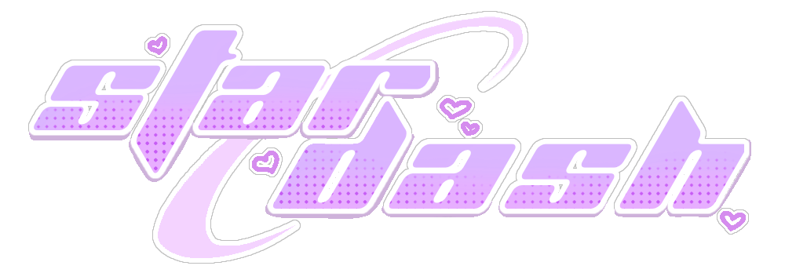
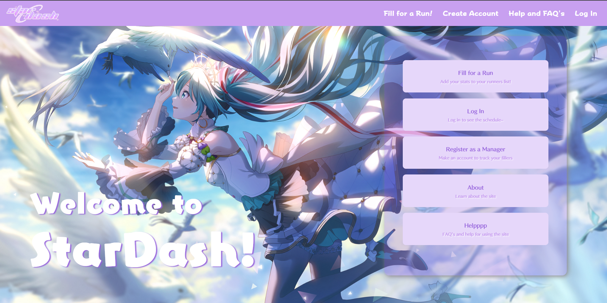

<a name="readme-top"></a>

<!-- PROJECT LOGO -->
<br />
<div align="center">
  <a href="https://github.com/ArchangeLillith/star-dash-frontend">
    
  </a>

  <p align="center">
    A scheduling website for tiering (getting a high rank in a one time event) in <a href="https://colorfulstage.com/">Project: Sekai</a>
    <br />
  
  </p>
</div>


<!-- TABLE OF CONTENTS -->
<details>
  <summary>Table of Contents</summary>
  <ul>
    <li>
      <a href="#about-the-project">About The Project</a>
      <ul>
        <li><a href="#built-with">Built With</a></li>
      </ul>
    </li>
    <li><a href="#deployment">Deployment</a></li>
    <li><a href="#usage">Usage</a></li>
    <li><a href="#roadmap">Roadmap</a></li>
    <li><a href="#gallery">Gallery</a></li>
    <li><a href="#for-developers">For Developers</a></li>
    <li><a href="#acknowledgments">Acknowledgments</a></li>
    <li><a href="#license">License</a></li>
  </ul>
</details>


<!-- ABOUT THE PROJECT -->
## About The Project



My largest project to date, this website is, in a nutshell, a schedule maker. However, it goes far beyond that. To understand what this website does, a bit of background is needed; to 'tier' in Project: Sekai, you have a runner (the person who's trying to score high), at least one manager (the main contact and scheduler), and fillers. Fillers are people who donate their time to help the runner reach high scores. Events are one time only, and last for 200 hours each. This website is a tool for managers to easily manage the 30+ people involved in these events. 

To get more complex, a team of people is five - one runner and four fillers. A team is usually created for every hour of the event whether or not the runner will actually play during that time. Further complicating this, one filler can come with anywhere from one to four teams <i>each</i>. This is where my website shines. A specific paramater (BP) is used to match make, if you have too high or low a BP, you won't be able to play. Calculting the best possible teams is handled by an algorithm when all four fillers are selected, and the top five best team combinations are displayed for the manager to select to add to that time slot. That's the bread and butter of this website - what once was a multiple week job of filling out spreadsheets by hand is now a button click. 

But how do we get filler information? Great question! The fillers themselves add it. No need to log in, just fill out a form and if the manager and event are correct, the fillers' information is tied to that manager for that event. Before StarDash, it was sent in a message through Discord, but now the manager doesn't have to handle all that data and take time to add it all into a spreadsheet! 

<p align="right">(<a href="#readme-top">back to top</a>)</p>


### Built With
<div align="center">

[![React][React.js]][React-url]
[![typescript][typescript]][typescript-url]
[![nodejs][nodejs]][nodejs-url]
[![express][express]][express-url]
[![Passport][Passport]][Passport-url]
[![JWT][JSON-web-tokens]][JSON-web-tokens-url]
[![MySQL][MySQL]][MySQL-url]
[![S3][S3]][S3-url]
[![bcrypt][bcrypt]][bcrypt-url]
[![js-cookie][js-cookie]][js-cookie-url]
[![cors][cors]][cors-url]
[![esbuild][esbuild]][esbuild-url]
[![eslint][eslint]][eslint-url]
[![vite][vite]][vite-url]
[![sass][sass]][sass-url]

</div>


<p align="right">(<a href="#readme-top">back to top</a>)</p>


<!-- GETTING STARTED -->
## Deployment
<div align="center">
To explore Knitters Fren, go see it in action: 
  <br/>
  <br/>
  
  [![knitters-fren][knitters-fren]][knitters-fren-url]
  
</div>


<p align="right">(<a href="#readme-top">back to top</a>)</p>


<!-- USAGE EXAMPLES -->
## Usage

I've found it challenging to know which of my patterns I'm looking for based on file name alone, and sometimes I forget I have a really pretty pattern I haven't used in a while. I'm hoping with the addition of pictures that I can more easily find what I'm looking for, and with the featured section rotating on every load I'll be exposed to more patterns!
<br/>
<br/>
As this website gains more users, I'm also hoping I can make a positive enviornment that people can share wonderful patterns they've used and it becomes a place that knitters can find wonderful new patterns to try.
<p align="right">(<a href="#readme-top">back to top</a>)</p>


<!-- ROADMAP -->
## Roadmap
- [x] Create the base of the site with CRUD functionality
- [x] Add styling
- [x] Add search functionality
- [ ] Allow the addition of images
    - [ ] Add the gallery and allow submissions of finished works


See the [project board](https://github.com/users/ArchangeLillith/projects/1) for a full list of intended features (and known issues).

<p align="right">(<a href="#readme-top">back to top</a>)</p>


<!-- GALLERY -->
## Gallery
Explore the pages of KnittersFren below through images!

<details open>
  <summary>🏠 Home View</summary>
 
</details>

<details>
  <summary>📜 All Patterns List</summary>
 
</details>

<details>
  <summary>🧵 Create a New Pattern</summary>
  
</details>

<details>
  <summary>🖼️ Detail View</summary>
  
</details>

<details>
  <summary>🔑 Login</summary>
 
</details>

<details open>
  <summary>✏️ Register</summary>
 
</details>

<details>
  <summary>🔍 Search View</summary>
  
</details>

<details>
  <summary>❌ Not Found Page</summary>
 
</details>

<p align="right">(<a href="#readme-top">back to top</a>)</p>

<!--DEV -->
### For Developers

If you'd like to run a local copy of this project, please follow the steps below to do so!

1. Clone the repo
   ```sh
   git clone https://github.com/ArchangeLillith/knitters-fren
   ```
2. Install NPM packages
   ```sh
   npm install
   ```
3. Boot the project (backend lives on localhost:3000, frontend lives on localhost:8000)
    ```sh
   npm run dev
   ```

<!-- ACKNOWLEDGMENTS -->
## Acknowledgments

Thank you to Elivaras who's been helping me learn version control and keeping my code clean by reviewing most of my commits! And thank you to [Covalence](https://covalence.io/) for their incredible support and amazing lectures (looking at you Luke and Andrew!)


<p align="right">(<a href="#readme-top">back to top</a>)</p>


<!-- LICENSE -->
## License

Distributed under the MIT License. See `LICENSE.txt` for more information.

<p align="right">(<a href="#readme-top">back to top</a>)</p>


[React.js]: https://img.shields.io/badge/React-20232A?style=for-the-badge&logo=react&logoColor=61DAFB
[React-url]: https://reactjs.org/
[typescript]: https://img.shields.io/badge/typescript-20232A?style=for-the-badge&logo=typescript&logoColor=#3178C6
[typescript-url]: https://www.typescriptlang.org/
[sass]: https://img.shields.io/badge/SASS-CFB1BB?style=for-the-badge&logo=sass&logoColor=#CC6699
[sass-url]: https://reactjs.org/
[vite]: https://img.shields.io/badge/vite-8A89FF?style=for-the-badge&logo=vite&logoColor=DAA520
[vite-url]: https://vite.dev/
[dayjs]: https://img.shields.io/badge/dayjs-FF6347?style=for-the-badge
[dayjs-url]: https://day.js.org/
[esbuild]: https://img.shields.io/badge/esbuild-F4C430?style=for-the-badge&logo=esbuild&logoColor=000000
[esbuild-url]: https://esbuild.github.io/
[eslint]: https://img.shields.io/badge/eslint-A78BFA?style=for-the-badge&logo=eslint&logoColor=000000
[eslint-url]: https://eslint.org/
[cors]: https://img.shields.io/badge/CORS-E8A87C?style=for-the-badge&logo=c&logoColor=8B4000
[cors-url]: https://github.com/expressjs/cors
[js-cookie]: https://img.shields.io/badge/JS_Cookie-D2B48C?style=for-the-badge&logo=javascript&logoColor=8B4513
[js-cookie-url]: https://www.npmjs.com/package/js-cookie
[bcrypt]: https://img.shields.io/badge/bcrypt-90EE90?style=for-the-badge&logo=bloglovin&logoColor=2A9D8F
[bcrypt-url]: https://github.com/kelektiv/node.bcrypt.js
[Bootstrap.com]: https://img.shields.io/badge/Bootstrap-563D7C?style=for-the-badge&logo=bootstrap&logoColor=white
[Bootstrap-url]: https://getbootstrap.com
[nodejs]: https://img.shields.io/badge/node.js-d8e3db?style=for-the-badge&logo=nodedotjs&logoColor=#fffffff
[nodejs-url]: https://nodejs.org/en
[express]: https://img.shields.io/badge/express-c3c6c7?style=for-the-badge&logo=express&logoColor=##9ccce6
[express-url]:https://expressjs.com/
[Passport]: https://img.shields.io/badge/Passport-4e5052?style=for-the-badge&logo=passport&logoColor=#62e371
[Passport-url]: https://www.passportjs.org/
[JSON-web-tokens]:https://img.shields.io/badge/JSON_Web_Tokens-6fd1cb?style=for-the-badge&logo=jsonwebtokens&logoColor=#fffffff
[JSON-web-tokens-url]: https://jwt.io/
[MySQL]: https://img.shields.io/badge/MySQL-ffffff?style=for-the-badge&logo=mysql&logoColor=#fffffff
[MySQL-url]: https://www.mysql.com/
[S3]: https://img.shields.io/badge/Amazon_S3-e5e5e5?style=for-the-badge&logo=amazon-s3
[S3-url]: https://aws.amazon.com/pm/serv-s3/?gclid=EAIaIQobChMIzbHh-_XgiAMVci2tBh0TGjcJEAAYASAAEgL-KvD_BwE&trk=936e5692-d2c9-4e52-a837-088366a7ac3f&sc_channel=ps&ef_id=EAIaIQobChMIzbHh-_XgiAMVci2tBh0TGjcJEAAYASAAEgL-KvD_BwE:G:s&s_kwcid=AL!4422!3!536324434071!e!!g!!amazon%20s3!11346198420!112250793838
